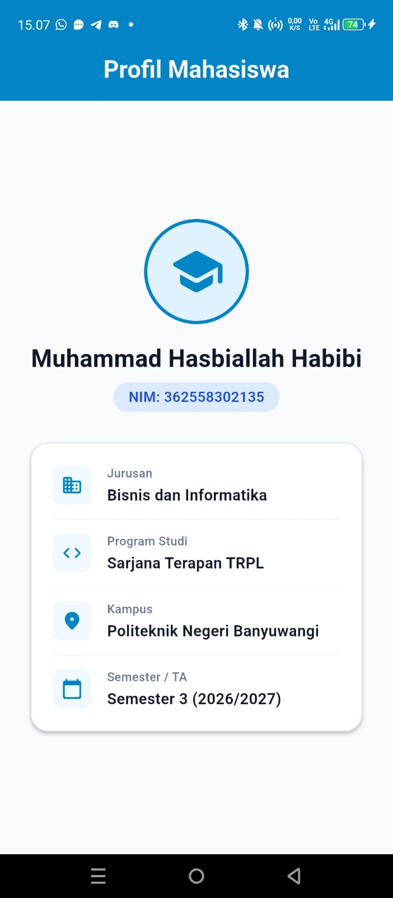

# Laporan Praktikum Modul 01: Mobile Ecosystem, Flutter Setup & Profile App

- **Nama**: Muhammad Hasbiallah Habibi
- **NIM**: 362558302135
- **Kelas / Prodi**: 2C / Sarjana Terapan TRPL
- **Mata Kuliah**: Pemrograman Perangkat Bergerak (Semester 3)

---

## 1. Ringkasan Aktivitas
Pada minggu ini, saya mempelajari tentang Evolusi Ekosistem Pengembangan Mobile. Mulai dari pengembangan secara Native, Hybrid, hingga ke Cross-Platform. Saya juga mempelajari arsitektur dari flutter itu sendiri, JIT dan AOT, UI = f(state), Struktur proyek flutter, Dart Sound Null Safety, dan Hot reload & Hot Restart.

Selain itu, saya juga melakukan instalasi flutter pada perangkat saya di VS Code. Setelah itu, saya menyambungkan perangkat hp saya ke laptop untuk menjalankan proyek flutter pertama yaitu Profile App.

## 2. Bukti Tangkapan Layar (Running App)
| Mode Portrait |
|---|
|  |

## 3. Kendala yang Dihadapi & Solusinya
- **Kendala**: Device tidak terkoneksi/terdeteksi di VS Code
- **Solusi**: Mengklik status "No Devices" pada pojok kanan bawah VS Code, lalu memilih perangkat yang akan dipakai.

## 4. Jawaban Pertanyaan Refleksi
1. **Pilihan Native vs Flutter**: Memilih native ketika aplikasi sangat bergantung pada integrasi API level rendah, fitur hardware spesifik, dan ukuran file instalasi kecil. Faktor penentu utamanya adalah kebutuhan fungsional proyek.
2. **Prinsip UI = f(state)**: Melalu prinsip deklaratif, saya bisa tahu kalau UI bisa didesain secara langsung dari kondisi data pada saat itu. Sehingga, meminimalkan bug inkonsistensi data tampilan.
3. **Pentingnya Conventional Commits**: Bisa membuat riwayat git terstruktur, rapi, informatif, serta bisa memudahkan dalam meninjau perubahan kode dan mempercepat pealcakan sumber masalah apabila terjadi bug.
