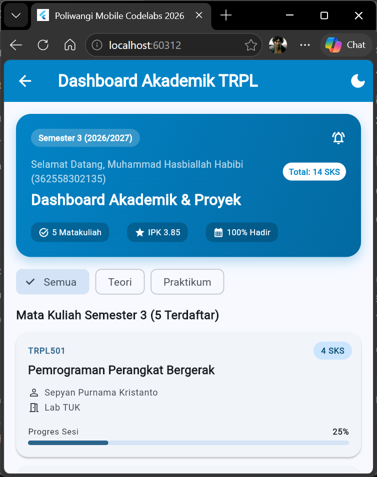
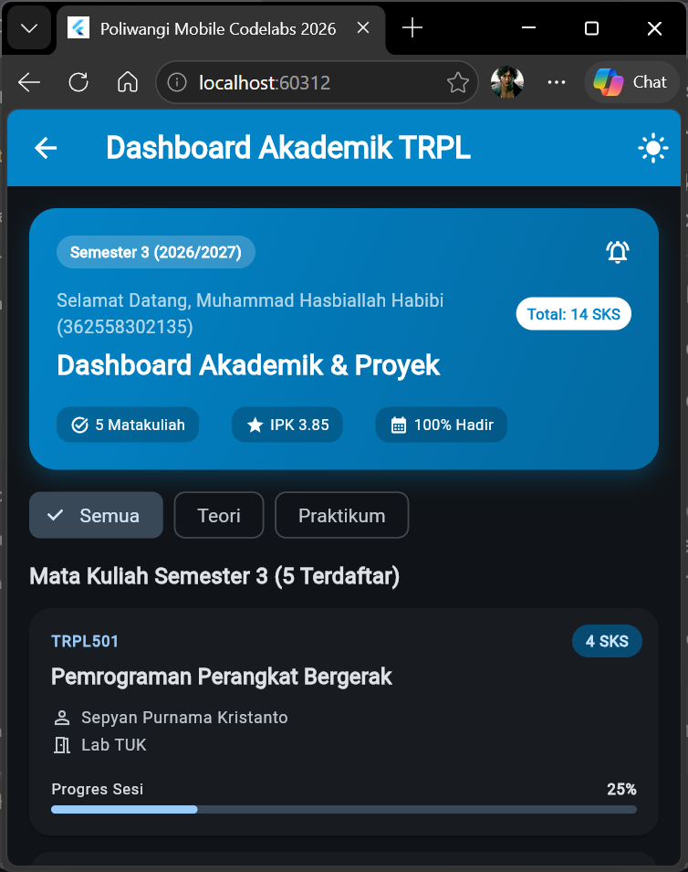
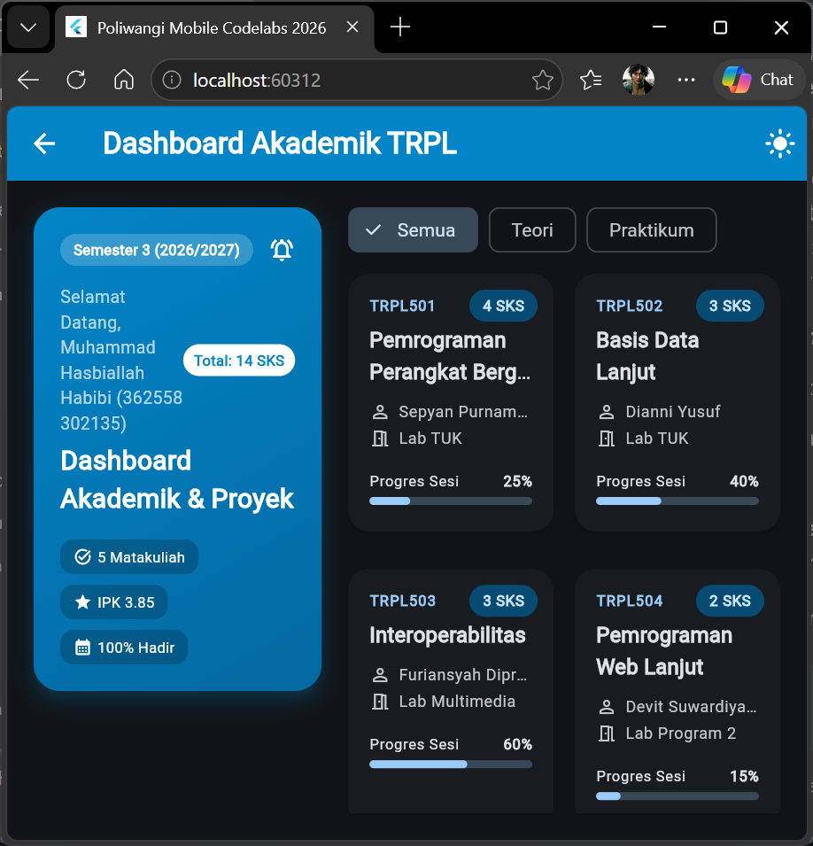

# Laporan Praktikum Modul 02: Declarative UI & Responsive Layout

- **Nama**: Muhammad Hasbiallah Habibi
- **NIM**: 362558302135
- **Kelas / Prodi**: 2C / Sarjana Terapan TRPL
- **Mata Kuliah**: Pemrograman Perangkat Bergerak (Semester 3)

---

## 1. Ringkasan Implementasi
Pada praktikum ini, antarmuka Dashboard Akademik dirancang menggunakan pendekatan *Declarative UI* di Flutter. Untuk memastikan tata letak yang responsif, digunakan widget `LayoutBuilder` yang membaca lebar layar (*constraints*). Jika lebar layar di bawah 600dp (Smartphone), layout di-render menggunakan `ListView` (satu kolom vertikal). Jika lebar layar mencapai 600dp atau lebih (Tablet/Desktop), layout otomatis beralih menjadi 2 kolom menggunakan kombinasi `Row` dan `GridView`. Pengelolaan tema difokuskan menggunakan spesifikasi Material 3 dengan `ColorScheme.fromSeed` pada `ThemeData`, sehingga transisi antara *Light Mode* dan *Dark Mode* dapat dilakukan secara konsisten dan terpusat.

## 2. Bukti Tangkapan Layar (Running App)
| Mode Portrait (Light) | Mode Dark Theme | Mode Landscape / Tablet (2 Kolom) |
|---|---|---|
|  |  |  |

## 3. Kendala Layout yang Dihadapi & Solusinya
- **Kendala**: Layar menjadi *blank* putih (crash/Unexpected null value) saat diuji coba pada mode Smartphone (ukuran kecil).
- **Solusi**: Hal ini terjadi karena penggunaan widget `Spacer()` di dalam `ListView` (yang memiliki ruang vertikal tidak terbatas/infinite). Solusinya adalah menghapus `Spacer()` pada file `course_card.dart` dan menggantinya dengan ruang statis `SizedBox(height: 16)`.
- **Kendala**: Terjadi *Bottom Overflow* (kartu menabrak batas bawah grid) pada mode Tablet.
- **Solusi**: Mengurangi rasio kotak (tinggi vs lebar) pada `GridView` dengan cara mengubah nilai `childAspectRatio` dari 1.4 menjadi 0.8 di dalam `SliverGridDelegateWithFixedCrossAxisCount` agar kartu menjadi lebih memanjang ke bawah.
- **Kendala**: Terjadi *Right Overflow* pada elemen status akademik di dalam `HeaderBanner`.
- **Solusi**: Mengganti widget pembungkus dari `Row` menjadi `Wrap` agar elemen yang kehabisan ruang di sebelah kanan dapat otomatis turun ke baris baru.

## 4. Jawaban Pertanyaan Refleksi
1. **Efisiensi Single-pass BoxConstraints**: Aturan ini membuat proses komputasi sangat efisien (O(N)) karena kalkulasi layout hanya dilakukan satu arah dan satu kali jalan (single-pass). Parent memberi batasan ukuran, child menentukan ukuran akhirnya, lalu parent menempatkan posisinya tanpa perlu bolak-balik menghitung ulang.
2. **Kriteria Modularisasi Widget**: Pecah menjadi file terpisah jika widget tersebut kompleks atau akan dipakai ulang di halaman lain. Sebaliknya, jadikan private widget di file yang sama jika kodenya pendek dan spesifik hanya digunakan di halaman tersebut agar struktur folder tetap bersih.
3. **Manfaat M3 ThemeData Terpusat**: Tema terpusat memungkinkan kita mengubah seluruh tampilan UI (warna, font, transisi Dark Mode) hanya dari satu tempat (blueprint utama). Ini jauh lebih praktis dan terstruktur dibandingkan memberi warna manual (hardcode) satu per satu di setiap widget yang rentan memunculkan bug atau terlewat saat ada revisi desain.