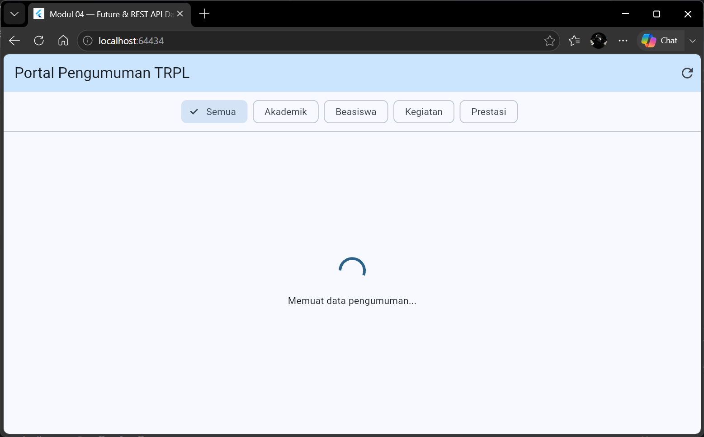
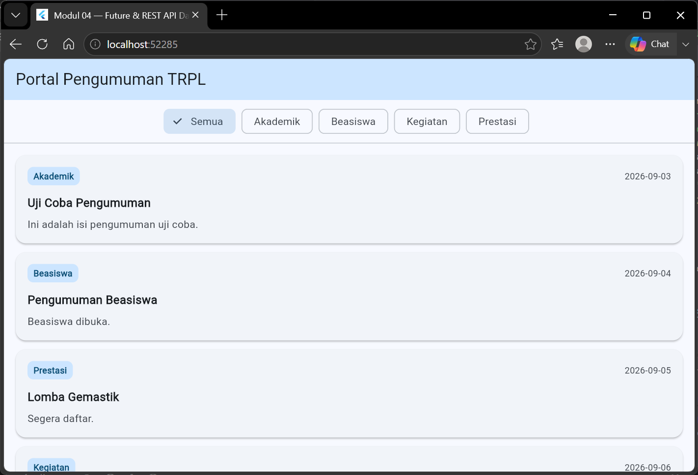
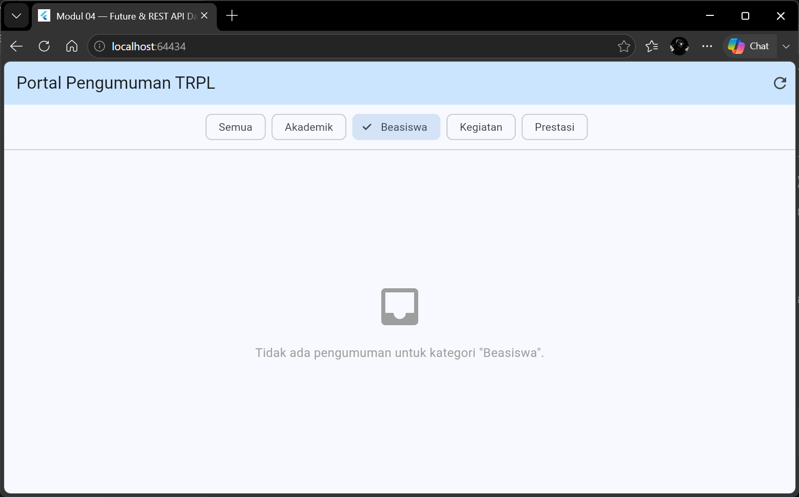
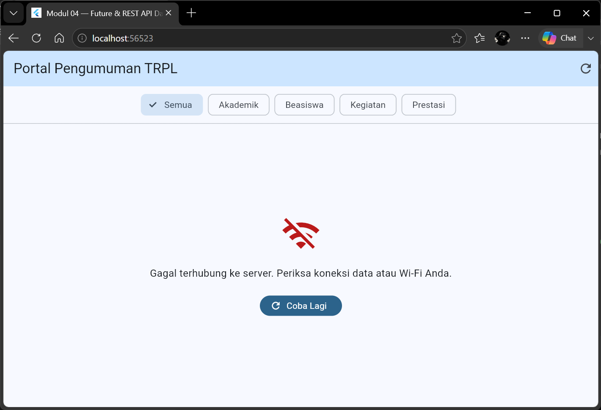

# Laporan Praktikum Modul 04: Future & REST API Dasar

- **Nama**: Muhammad Hasbiallah Habibi
- **NIM**: 362558302135
- **Kelas / Prodi**: 2C / Sarjana Terapan TRPL
- **Mata Kuliah**: Pemrograman Perangkat Bergerak (Semester 3)

---

## 1. Ringkasan Implementasi
Pada praktikum ini, aplikasi Portal Pengumuman TRPL dibangun untuk mendemonstrasikan pengambilan data dari jaringan (REST API) menggunakan `Future`, `FutureBuilder`, dan *package* `http` (Fase A), yang kemudian dirombak menggunakan `Dio`, `Riverpod`, dan `Repository Pattern` (Fase B). Arsitektur difokuskan pada pengelolaan *asynchronous programming* di mana UI harus mampu merespons empat keadaan (*state*) yang berbeda: saat data sedang dimuat (*Loading*), saat terjadi kegagalan jaringan atau *timeout* (*Error*), saat data berhasil diambil namun kosong (*Empty*), dan saat data berhasil dirender menjadi daftar (*Success*). Pemetaan data JSON mentah menjadi objek model Dart ditangani secara aman menggunakan *factory* `fromJson` yang dilengkapi nilai cadangan (*default values*) untuk mencegah *crash* akibat field JSON yang bernilai *null*.

## 2. Bukti Tangkapan Layar (4 Keadaan UI)
| Keadaan Memuat (Loading) | Keadaan Berhasil (Success) | Keadaan Kosong (Empty) | Keadaan Gagal (Error) |
|---|---|---|---|
|  |  |  |  |

---

## 3. Jawaban Pertanyaan Refleksi

**1. Pemindahan penyaringan kategori (Fase A di build() vs Fase B di repository)**
Pemindahan logika penyaringan ke repository (Fase B) membuat pemisahan peran (*separation of concerns*) menjadi lebih mudah dan rapi. UI tidak perlu lagi memikirkan bagaimana cara data disaring; ia hanya bertugas meminta data dengan menyisipkan parameter `category`. Hal ini sangat menguntungkan jika di masa depan penyaringan harus dilakukan langsung di sisi server (melalui *query parameter* HTTP), karena kode UI sama sekali tidak perlu diubah. Namun, hal yang menjadi lebih sulit adalah pengelolaan alur reaktivitasnya (*state management*). Di Fase A, kita cukup memanggil `setState`, sementara di Fase B, kita harus membuat `NotifierProvider` terpisah untuk memantau kategori terpilih, lalu mengikatnya ke `FutureProvider` menggunakan `ref.watch`. *Boilerplate* (kode dasar) bertambah, dan alurnya tidak lagi selinier di Fase A.

**2. Bahaya menelan error dengan catch (e) { return []; }**
Menelan *error* (error swallowing) dengan mengembalikan *list* kosong adalah praktik yang sangat buruk karena akan menyesatkan pengguna. Jika internet terputus atau server sedang lumpuh, aplikasi justru akan menampilkan Keadaan Kosong (Empty State) dengan pesan seperti "Tidak ada pengumuman". Pengguna akan mengira memang tidak ada informasi terbaru dari kampus, padahal aplikasinya yang gagal terhubung. Keputusan yang seharusnya dilakukan adalah menangkap *exception* yang spesifik (seperti `TimeoutException` atau `ClientException`) lalu melempar ulang (`throw`) pesan *error* yang jelas. Dengan begitu, *FutureBuilder* dapat mendeteksi kegagalan tersebut melalui `snapshot.hasError` dan merender Keadaan Gagal (Error State) beserta tombol "Coba Lagi", sehingga pengguna tahu persis letak masalahnya.

**3. Perbedaan const list di Fase A dan List.of di Fase B**
Pada Fase A, `AnnouncementApi` dirancang murni hanya untuk melakukan operasi membaca (GET) data dan menampilkannya di layar, sehingga tidak ada kebutuhan untuk merubah isi data tersebut. Mengembalikan *list* berstatus `const` (immutable) pada kondisi ini sangat aman dan efisien secara memori. Sebaliknya, pada Fase B, antarmuka `AnnouncementRepository` menetapkan kontrak yang mewajibkan adanya operasi modifikasi data melalui fungsi `addAnnouncement()`. Jika `SampleAnnouncementRepository` menggunakan *list* `const`, maka pemanggilan fungsi `.add()` akan langsung menyebabkan *crash* `UnsupportedError: Cannot add to an unmodifiable list` saat aplikasi berjalan. Oleh karena itu, penyalinan menggunakan `List.of` wajib dilakukan di Fase B agar *list* tersebut menjadi fleksibel (mutable) dan dapat menerima data baru saat pengujian luring (*offline*).

**4. Perilaku retry otomatis pada Riverpod 3**
Mencoba ulang (*retry*) otomatis dengan *exponential backoff* dipilih sebagai perilaku bawaan Riverpod karena koneksi jaringan (terutama seluler) sangat rentan terhadap gangguan sesaat (flaky). Contoh situasi yang menguntungkan: pengguna sedang berada di kereta, lalu koneksi putus selama 1 detik tepat saat aplikasi sedang melakukan *fetch* data. Riverpod akan merespons ini dengan mencoba ulang secara otomatis di latar belakang, *request* akhirnya berhasil, dan pengguna mendapat pengalaman mulus tanpa perlu menekan tombol "Coba Lagi" secara manual. Namun, perilaku ini justru merugikan jika *error* bersifat deterministik (pasti selalu gagal). Contoh situasi merugikan: saat permintaan gagal karena di-blokir (*error 401 Unauthorized* atau *404 Not Found*). Melakukan *retry* otomatis pada *error* ini tidak akan membuahkan hasil, justru hanya akan membuang kuota internet, memperlambat respon antarmuka, dan berisiko membuat akun pengguna dikunci sementara (*rate-limited*) oleh server karena dianggap melakukan *spam request*.

**5. Pembatasan kuota API dan penyesuaian FutureBuilder**
Jika endpoint kampus hanya boleh dipanggil sekali per hari, implementasi `FutureBuilder` murni seperti di Fase A menjadi tidak layak. Meskipun *Future* sudah disimpan di dalam siklus *State*, jika pengguna menutup layar (*pop*) dan membukanya kembali (*push*), fungsi `initState` akan berjalan ulang, menciptakan *Future* baru, dan memicu *request* HTTP lagi sehingga kuota harian akan langsung jebol. Perubahan paling sedikit yang perlu dilakukan untuk mencegah hal ini adalah menambahkan mekanisme *caching* sederhana di tingkat kelas API. Di dalam `AnnouncementApi`, kita cukup mendeklarasikan variabel `static List<Announcement>? _cacheData;`. Di dalam fungsi `ambilPengumuman()`, tambahkan logika pengecekan di awal baris: jika `_cacheData` tidak *null*, langsung *return _cacheData* tanpa menyentuh jaringan. Jika *null*, lakukan *request* HTTP, simpan hasilnya ke dalam `_cacheData`, barulah menampilkannya ke layar.